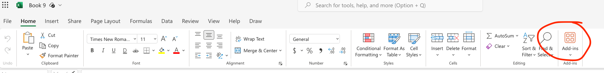
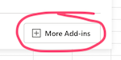
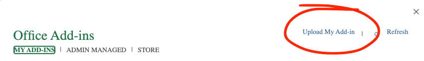
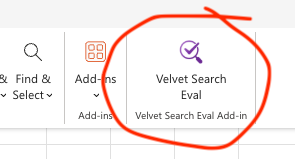

# Velvet


🚀 Run your RAG evaluations in a few minutes using Excel.

## Note

This is not an official Google product

## Features

- 🤖 **AgentSpace (Answer) Evaluation:** Evaluate Vertex AI Search "Answer" type agents. This is similar to the RAG Search Evaluation but is specifically designed for agents that provide direct answers.
  - **Metrics Calculated:** 
    - Summary Match (using LLM as judge)
    - First Link Match (Precision@1)
    - Link in Top 2 (Precision@2)
  - **Grounding Score** [Grouding support scores](https://cloud.google.com/generative-ai-app-builder/docs/answer#return-support-scores) for answers.
- 🔍 **RAG Search Evaluation (Generic):** Evaluate the accuracy of your [Vertex AI Search](https://cloud.google.com/enterprise-search) using your own test cases for generic search applications.

  - **Metrics Calculated:** Summary Match (using LLM as judge), First Link Match (Precision@1), and Link in Top 2 (Precision@2).
  - **Grounding Score** calculated for each result using [Check Grounding API](https://cloud.google.com/generative-ai-app-builder/docs/check-grounding)
- 📝 **Synthetic Q&A Generation:** Don't have test cases? No problem! Generate synthetic question-answer pairs based on your documents. Specify a GCS path, customize the prompt, and control the quality of generated Q&A.

- ⚡️ Ability to run hundreds of test cases in seconds.
- ⚙️ Configurable Vertex AI Search Agent parameters and Gemini settings
- 📊 Detailed status updates and logs for monitoring and troubleshooting.
- 💼 Works with Excel Web (Microsoft 365) and Excel Desktop.

## Quick Start

### 1. Install the Excel Addin

Follow the [Instructions](#installation)

### 2. Authenticate and Create Placeholder Tables

- Generate Access Token

```
gcloud auth print-access-token
```

- Paste the GCP access token in the designated field within the add-in.
- Use the add-in's functionality to create the necessary placeholder tables in your Excel sheet. These tables will structure your test data and results.

### 3. Input Data and Run Tests

- Populate the test case tables with your data.
- Configure the Vertex AI Search Agent settings (search type, summary settings, etc.) within the add-in.
- Initiate test runs using the provided buttons.

## Why?

- 🧑‍💻 Run your search acceptance test cases without leaving Excel.
- ✅ Enables Business and Compliance teams to measure search accuracy without any training or developer skills using the tool they use every day.
- 🗒️ Allows comparing of different test runs using different settings to determine the correct values for a specific use case.
- 🚀 Accelerates search application validation from weeks/months to hours.
- 🤖 Coz testing manually is hard, boring and no fun!

## Installation <a id="installation"></a>

Only [sideloading](https://learn.microsoft.com/en-us/office/dev/add-ins/testing/test-debug-office-add-ins#sideload-an-office-add-in-for-testing) is supported at this time.

### Excel Web (Microsoft 365)

- Download the [manifest.xml](manifest.xml) file to your local machine.
- Open Excel in your browser.
- Click on the "Add-ins" button and select "More Add-Ins".



- Click on the "Upload My Add-in" link



- Select the manifest.xml file from your local machine and click on the "Open" button.



- You should now see the Velvet Add-in listed in the Add-ins menu.



To remove it just clear your browser cache.

### Excel Desktop

- Download the [manifest-search.xml](manifest-search.xml) file to your local machine.
- Place this file in the following location:
  - **Windows**: Follow instructions [here](https://learn.microsoft.com/en-us/office/dev/add-ins/testing/create-a-network-shared-folder-catalog-for-task-pane-and-content-add-ins).
  - **Mac**:
    - Use Finder to sideload the manifest file. Open Finder and then enter `Command+Shift+G` to open the Go to folder dialog.
    - Navigate to the following location: `/Users/<username>/Library/Containers/com.microsoft.Excel/Data/Documents/wef`
    - If the `wef` folder doesn't exist on your computer, create it.
    - Save the [manifest-search.xml](manifest-search.xml) file in the wef folder.
- Open Excel.
- Confirm that the Velvet Add-in is listed in the Home Ribbon.
